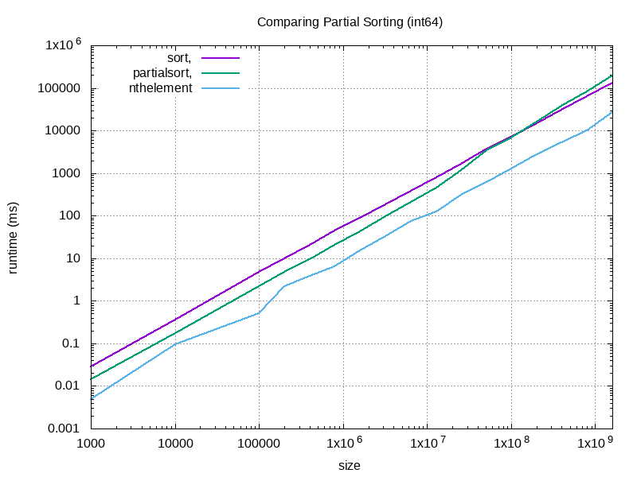
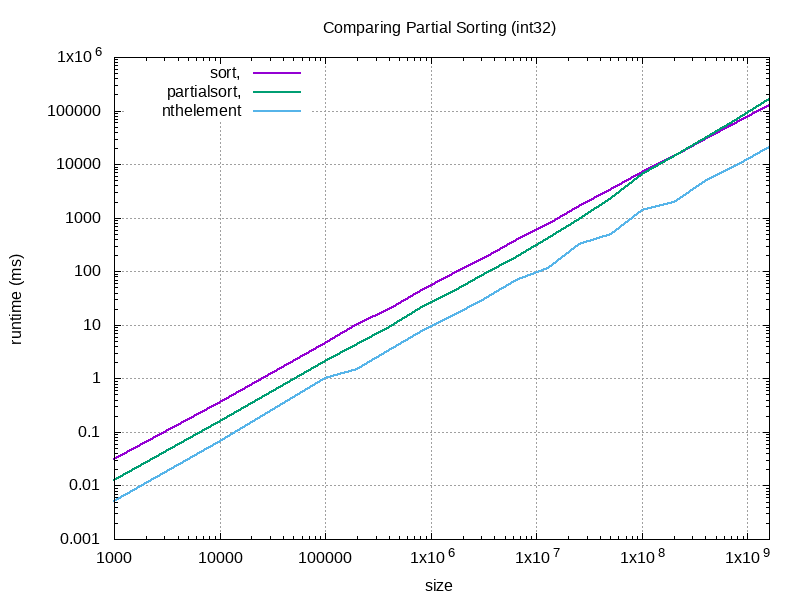
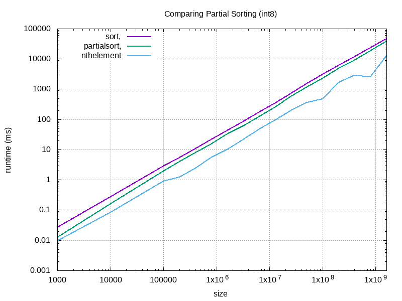

# Comparing Partial Sort

This is a small C++ project to compare the performance of partial sorting of data using STL algorithms. Imagine the requirement to get the top `x` percent of elements in a collection `v` in sorted order. There are a few ways to do so:

1. sort the entire container with `sort(begin, end)` and then use elements from `begin` to `partition`
2. partially sort the container with `partial_sort(begin, partition, end)`
3. partition the container with `nth_element(begin, partition, end)` and then `sort(begin, partition)`

where

```
begin = begin(v)
end = end(v)
partition = begin + x * v.size()
```

Which one is fastest? The answer might not be so obvious.

## Requirements

The following software components are required to run this project:
```
g++     # (or any other C++ compiler)
make
tee
gnuplot
```

It has been tested on Ubuntu 20.04.

## Running

Just run `make` to compile, run the benchmark and generate a plot comparing the runtime.

## Results

The results below were generated with `x=0.1`, so the top 10% elements have to be sorted.

One might expect `partial_sort` to be the fastest, since it has to do the least work (just sort 10% of the vector in a single pass). The `nth_element` method
partitions the vector first, and sorts it afterwards, so this requires at least two passes. Sorting the entire vector with `sort`, where 90% of the elements are
going to waste, sounds inefficient.

As shown below, the `nth_element` method is consistently the fastest. Using `partial_sort` is faster than sorting the entire vector for most of the sizes
tested, but for very large sizes, an interesting effect can be observed: After a certain buffer size, `partial_sort` actually becomes slower than `sort`. This effect occurs earlier for larger datatypes. Notice how the intersection between the plot lines for `sort` and `partial_sort` is further on the right for `int32`, and cannot be seen at all for `int8`.



The following results are for a 32-bit datatype (`int32_t`):



The following results are for a 8-bit datatype (`int8_t`):



## Conclusion

Why can these effect be observed? Stay tuned!
